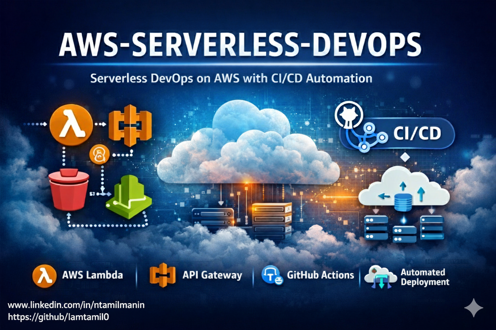

<p align="center">
  
</p>

<h1 align="center">AWS-SERVERLESS-DEVOPS</h1>

<p align="center">
  Serverless DevOps Project using AWS & CI/CD Automation
</p>

<p align="center">
  👤 GitHub: <a href="https://github.com/iamtamil0">iamtamil0</a> |
  🔗 LinkedIn: <a href="https://www.linkedin.com/in/ntamilmanin/">Profile</a>
</p>


A hands-on **DevOps + Serverless** project demonstrating how to build, deploy, and automate a **serverless application on AWS** using modern DevOps practices.

This project focuses on **automation, scalability, security, and cost efficiency** by leveraging AWS managed services instead of traditional server-based infrastructure.

---

## 📌 Project Overview

**AWS-SERVERLESS-DEVOPS** showcases a real-world serverless DevOps workflow where application code is automatically built and deployed using CI/CD pipelines.

The project removes the need for server management and enables faster, safer, and more reliable deployments.

---

## 🏗️ Architecture Overview

```
Developer → GitHub → GitHub Actions (CI/CD)
                       ↓
                    AWS S3 (Artifacts)
                       ↓
                 AWS Lambda (Serverless)
                       ↓
               API Gateway (Public API)
                       ↓
               CloudWatch (Logs & Metrics)
```

---

## 🛠️ Technologies & Services Used

### 🔹 AWS Services

* **AWS Lambda** – Serverless compute
* **Amazon S3** – Artifact & static storage
* **Amazon API Gateway** – API exposure
* **IAM** – Secure access & role management
* **Amazon CloudWatch** – Logging & monitoring

### 🔹 DevOps & Tools

* **GitHub Actions** – CI/CD automation
* **Terraform (Optional)** – Infrastructure as Code
* **AWS CLI** – Cloud interaction
* **Linux** – Development & automation environment

---

## 🔄 CI/CD Workflow

1. Code is pushed to **GitHub repository**
2. **GitHub Actions** pipeline is triggered
3. Application is built and packaged
4. Artifacts are uploaded to **Amazon S3**
5. **AWS Lambda** function is updated automatically
6. **API Gateway** serves the updated application
7. Logs and metrics are tracked in **CloudWatch**

---

## 🎯 Key Features

✔ Fully serverless architecture (no EC2)
✔ Automated CI/CD pipeline
✔ Secure IAM-based access
✔ Scalable and highly available
✔ Cost-effective cloud design
✔ Real-world DevOps implementation

---

## 📚 What You Will Learn From This Project

* How serverless architecture works on AWS
* Automating deployments using GitHub Actions
* Managing permissions with IAM roles and policies
* Deploying applications without managing servers
* Monitoring and logging using CloudWatch
* Applying DevOps best practices in cloud projects

---

## 🚀 How to Run / Deploy (High-Level)

1. Clone the repository
2. Configure AWS credentials
3. Set up IAM roles and policies
4. Configure GitHub Actions secrets
5. Push code to trigger CI/CD pipeline
6. Access the API via API Gateway endpoint

---

## 🔮 Future Enhancements

* Terraform-based full infrastructure automation
* Add DynamoDB for database integration
* Implement DevSecOps security scanning
* Add monitoring dashboards (Grafana)
* Blue/Green deployment strategy

---

## 🧑‍💻 Author

**iamtamil0**
System Administrator | AWS DevOps Engineer | Cloud & DevOps Enthusiast

GitHub: [https://github.com/iamtamil0](https://github.com/iamtamil0)

---

## 🏷️ Tags

`AWS` `Serverless` `DevOps` `GitHub Actions` `CI/CD` `Cloud Computing` `AWS Lambda` `API Gateway`

---

⭐ If you found this project helpful, feel free to **star the repository** and connect with me on LinkedIn!